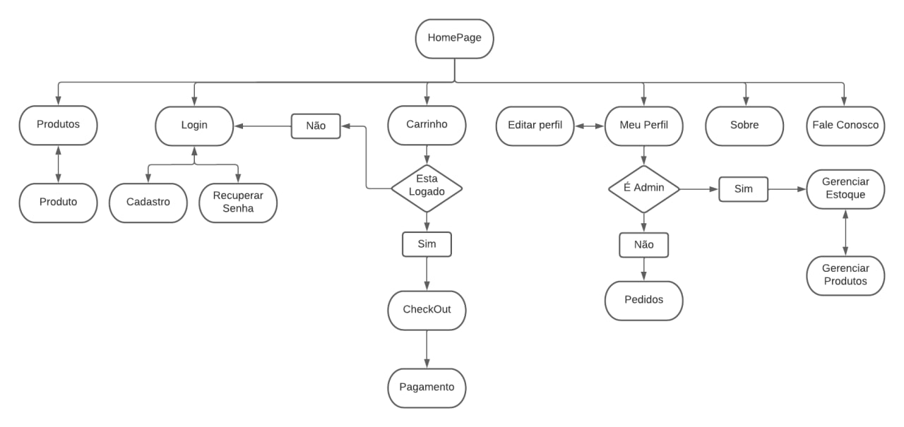

# Hortifood

Trabalho para a disciplina SCC0219 - Introdução ao Desenvolvimento Web 2023

| NUSP          | Nome                           |
| ------------- | ------------------------------ |
| 12694007      | Susy da Costa Dutra            |
| 10691331      | Theo da Mota dos Santos        |
| 12608793      | Yvis Freire Silva Santos       |

## 1. Requisitos

- O sistema deve ter 2 tipos de usuários: **Clientes** e **Administradores**.
  - Administradores são responsáveis por registrar/gerenciar administradores, clientes e produtos/serviços fornecidos. O aplicativo já vem com uma conta admin com senha admin.
  - Clientes são usuários que acessam o sistema para comprar produtos/serviços.

- Armazenar os seguintes registros 
  - **administrador**: nome, id, telefone, e-mail.
  - **cliente**: nome, id, endereço, telefone, e-mail.
  - **produtos**: nome, id, foto, descrição, preço, quantidade (em estoque), quantidade vendida.

- O sistema deve atender aos requisitos de acessibilidade e oferecer boa usabilidade. O sistema deve ser responsivo, ou seja, deve concluir as tarefas atribuídas dentro de um tempo razoável.
## 2. Descrição do Projeto
O Hortifood trata-se de um serviço de compras online (e-commerce) de frutas e verduras feito especialmente para a região de São Carlos.
- Navegação do Cliente: O Cliente pode acessar os produtos na Homepage, filtrar por categorias, como sucos ou frutas da temporada. O site permite o cadastro e login do Cliente e a venda com entrega dos produtos.
- Venda de produtos: Os produtos são selecionados, sua quantidade escolhida e são incluídos em um carrinho. Os produtos são comprados usando um número de cartão de crédito (qualquer número é aceito pelo sistema). A quantidade de produto vendido é subtraída da quantidade em estoque e adicionada à quantidade vendida. Os carrinhos são esvaziados somente no pagamento ou pelos clientes.
- Gerenciamento de produto: Os administradores podem criar/atualizar/lêr/excluir (crud) novos produtos. Por exemplo, eles podem alterar a quantidade em estoque.
- Funcionalidade Específica: Criamos uma funcionalidade específica para nosso aplicativo. Ao comprar uma fruta, pode-se indicar também o quão madura o cliente a deseja.

### <a href="https://www.figma.com/file/udP8nKb9EDOPpY6em9cQuO/Hortifood?type=design&node-id=0%3A1&t=KiCEtRygFs5BtLsY-1">Mockup no Figma</a>
### Diagrama de Navegação

## 3. Comments About the Code
## 4. Test Plan
## 5. Test Results
## 6. Build Procedures
## 7. Problems
## 8. Comments
